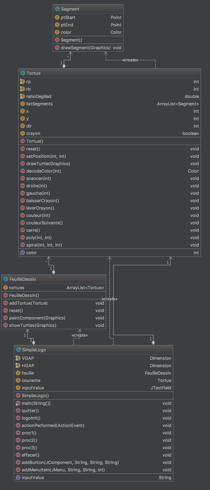
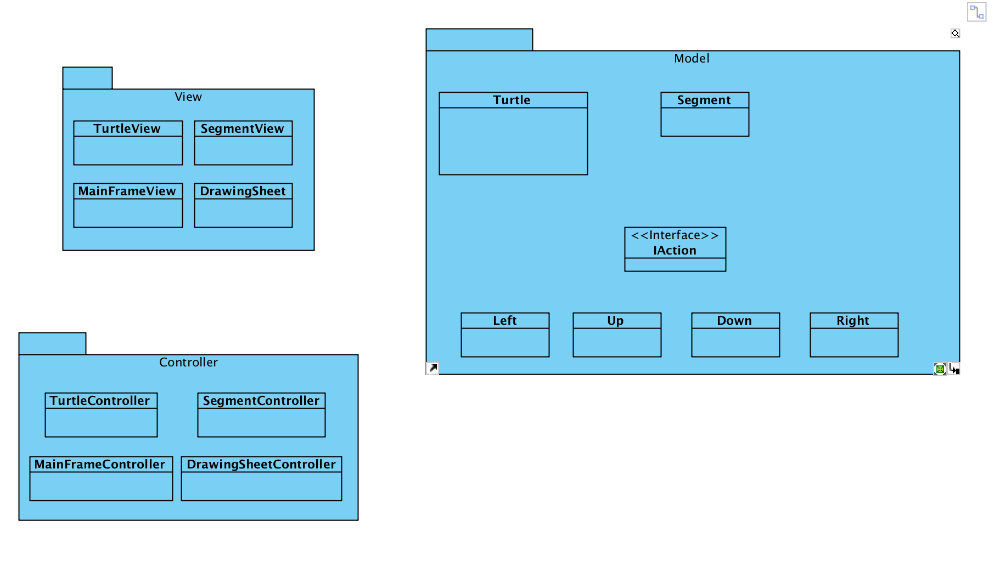
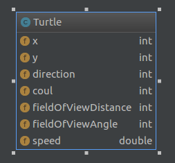
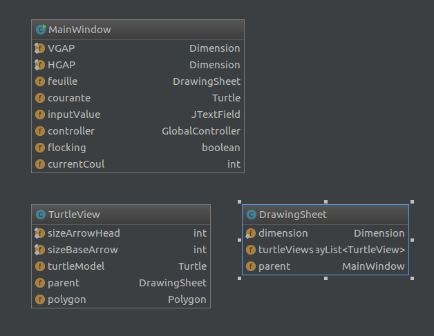
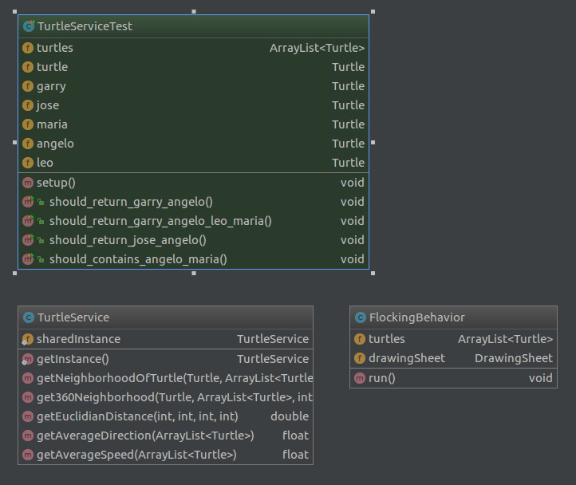
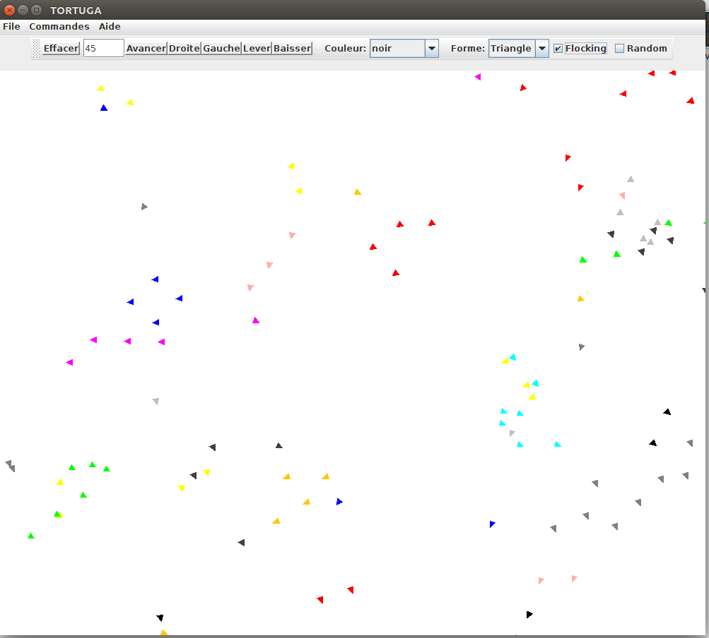

**Nom/Prénom Etudiant 1 :** LATHUILIERE Yoann

**Nom/Prénom Etudiant 2 :** MONTES Yannick

# Rapport TP4

## Question 1
La première chose que nous avons faite a été de tester le code, c'est à dire lancer le programme et découvrir les fonctionnalités.
Nous avons pu voir que tout fonctionnais parfaitemnt et qu'il n'y avait à prioris aucun bug critique.

Nous nous sommes ensuite concentrés sur la conception du programme en générant grâce à notre IDE un diagramme de classe.
Nous avonns alors constaté que **le programme ne respectait pas le modèle MVC**. Ainsi, les classes du programmes avaient plusieurs rôles : définir le modèle de l'objet, l'afficher... Ceci ne respectant pas un principe S.O.L.I.D : Single Class Responsability
  
Voici ci-dessous le diagramme de classes généré par notre IDE :

 

La dernière étape de notre aalyse a été de d'analyser le code en lui même, a la recherche d'anomalies. Nous avons trouvé plusieurs "erreurs" de code, comme par exemple :
* Code en plusieurs langues : certaines variables en anglais, d'autres en français...
* Variables et fonctions mal nommés : noms non explicites, variables nommés sur avec une seule lettre...
* Mauvaise utilisation des "if" : présence d'une cascade de "if else" dans une des classes alors que l'utilsation d'un switch rendrait le code beaucoup plus lisibile
* Mauvaise optimisation du code : appels de fonctions appelé plusieurs fois dans le même but alors que stocker le résultat dans une variable optimiserai l'execution
* Aucun test unitaire dans le projet
* Divers problèmes de conventions : noms de packages avec des majuscules, indentation...

## Question 2

Nous avons décidé d'implémenter un pattern MVC de la manière suivante:

Cela permet de séparer les traitements de manière plus cloisonnée, 
afin de respecter l'idée qu'aucun code concenant l'affichage se mélanger avec le modèle. 

De la même manière, le controlleur permet de gérer les appuis utilisateur et de communiquer entre la vue et le modèle. 

Nous sommes partis de ce diagrame pour finalement arriver à ceci:

Ici, les seuls modèles que nous avons sont les tortues. 
Ces dernières communiquement immédiatement avec leur vue respective, représentée par TurtleView.
A chaque changement d'une tortue, la vue est notifiée, ce qui a pour effet de redessiner cette dernière en fonction des
changements, sur la feuille de dessin. 

Nous n'avons pu vu l'utilité de détailler les controlleurs. En effet, l'utilisateur peut utiliser une seule tortue à la fois, 
par conséquent le controlleur ne concerne qu'une seule tortue. 

Nous avons simplement déplacer le code de gestion de cette dernière au sein de ce controlleur. 

En ce qui concerne le package Services, c'est un package qui permet de stocker différents comportement pour les tortues (ex: flocking)

## Question 3
Pour cette question, voir le code des classes du projet.

## Question 4

Notre application ressemble désormais à ceci: 

Ou il est possible de créer une tortue via le menu "File" -> Créer une tortue

La couleur utilisée lors de la création de la tortue est celle que l'on peut choisir dans le menue déroulant. 

On peut faire bouger la tortue via les boutons avancer/reculer, ect...

La tortue controlée est celle sur laquelle l'utilisateur à cliqué. 

## Question 5

Nous avons implémentés un traitement au sein d'un thread (RandomBehavior) permettant aux tortues de se déplacer de manière aléatoire. 

Chaque tortue change sa direction et sa vitesse respectivement en moyenne 1 fois sur 5 et 1 fois sur 4. 

Pour lancer ce mode, il suffit de cocher la checkbox "Random" de l'IHM. Ce mode désactive le flocking ainsi que le contrôle manuel des tortues mais également la création de nouvelles tortues.

## Question 6

L'application propose maintenant trois modes différents. 
Par défaut, lorsqu'on lance l'application, c'est le mode "Manuel" qui est actif. 

Dans ce mode, on peut ajouter autant de tortues qu'on veut à la feuille (en choissisant sa couleur et sa forme), puis cliquer dessus pour la controler. 

Le second mode disponible est le mode "Random", dans lequel les tortues se déplacent de manière autonome (cf. Question 5). 
Pour accéder à ce mode, il faut cocher la case "Random" de l'IHM.

Le dernier mode est le "Flocking", permettant aux tortues de se comportement comme des oiseaux (logique), de manière à suivre leurs congénères. 

Pour ce faire, nous avons implémenter un champ de vision: chaque tortue peut voir dans un cône d'un certain angle (fixé par défaut à 130° devant elle, 65 a droite et 65 a gauche) ainsi qu'une certaine distance (fixée à 50).

Dans le mode flocking, lorsqu'une tortue apperçoit une tortue dans son champ de vision, elle va décider de suivre cette tortue, en prenant la vitesse et direction de cette dernière. 
Cela entraine un effet de groupe très rapide. 

Dans le logiciel, ce comportement est effectué par couleur (une tortue rouge suivra uniquement les tortues rouges). 

Pour lancer ce mode, il faut cocher la box "Flocking", ce qui aura pour effet de désactiver les deux modes présentés précédemment. 

## Bonus
Nous avons aussi ajouté a l'application les fonctionalités suivantes :
* Tests unitaire
* Forme des tortues (triangle et rond)
